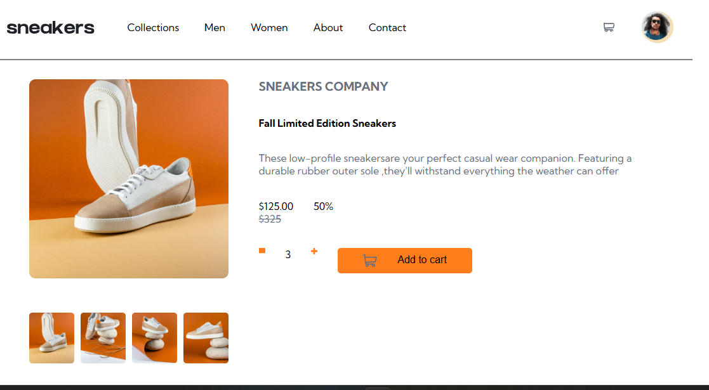

# Frontend Mentor - E-commerce product page solution

This is a solution to the [E-commerce product page challenge on Frontend Mentor](https://www.frontendmentor.io/challenges/ecommerce-product-page-UPsZ9MJp6). Frontend Mentor challenges help you improve your coding skills by building realistic projects.

Live Site:(https://ecommerce-grid-challenge.vercel.app/)

## Table of contents

- [Overview](#overview)
  - [The challenge](#the-challenge)
  - [Screenshot](#screenshot)
  - [Links](#links)
- [My process](#my-process)
  - [Built with](#built-with)
  - [What I learned](#what-i-learned)
 


## Overview

### The challenge

Users should be able to:

- View the optimal layout for the site depending on their device's screen size
- See hover states for all interactive elements on the page
- Open a lightbox gallery by clicking on the large product image
- Switch the large product image by clicking on the small thumbnail images
- Add items to the cart
- View the cart and remove items from it

### Screenshot




### Links


- Live Site:(https://ecommerce-grid-challenge.vercel.app/)


### Built with

- Semantic HTML5 markup
- CSS custom properties
- Flexbox
- CSS Grid


### What I learned

How to effectively use flexbox and grid to come up with a working frontend project. Use of technologies such as grid-template-columns and grid-template-rows simplify the work 

To see how you can add code snippets, see below:

```html
<h1>Some HTML code I'm proud of</h1>
<div class="container">
  <p>hello</p>
  </div>
```
```css
.proud-of-this-css {
  grid-template-columns:repeat(3,1fr);
  grid-template-rows: 2fr 1fr 2fr;
}
```


